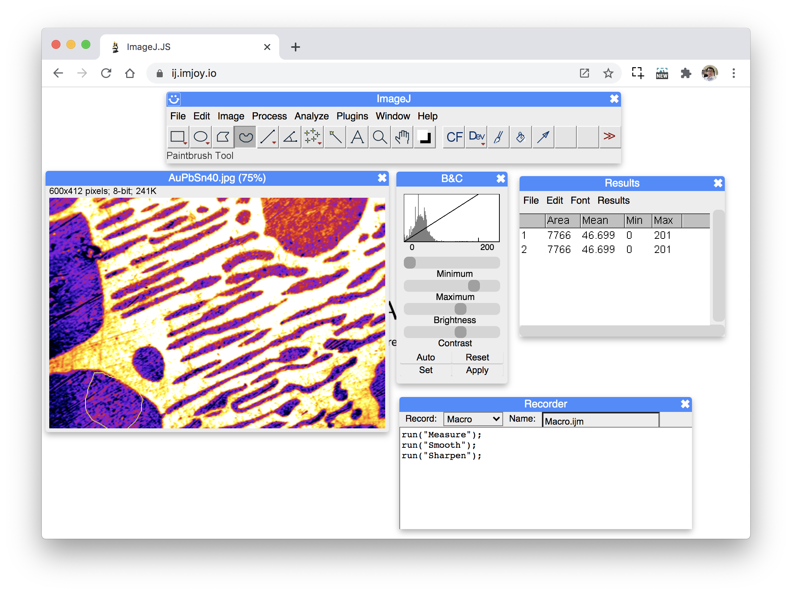

# ImageJ.JS: ImageJ running in the browser
[](https://mybinder.org/v2/gh/imjoy-team/imagej.js/master?filepath=examples%2Fgetting-started.ipynb)
[](https://imjoy.io/#/app?workspace=imagej&plugin=https://ij.imjoy.io)
[](https://colab.research.google.com/github/imjoy-team/imagej.js/blob/master/examples/getting-started.ipynb)

[ImageJ](https://imagej.nih.gov/ij/) is an open source image processing program designed for scientific multidimensional images. It was originally written in Java and available mainly on desktop computers. We compiled it into [WebAssembly](https://webassembly.org/) and Javascript with a Java compiler called [CheerpJ](https://www.leaningtech.com/pages/cheerpj.html) with additional features to connect it with the ImJoy plugin ecosystem.

You can run ImageJ with all mainstream browsers with one click, no installation and no Java runtime environment needed. It also works on mobile devices.

Try ImageJ.JS here: https://ij.imjoy.io




This project is currently under development, please expect frequent changes.

## ImJoy Integration and API

ImageJ.JS supports two-way integration with ImJoy, meaning you can either use it as an ImJoy plugin or load other ImJoy plugins into ImageJ.JS. This a a powerful combination, since it brings useful features from ImageJ including file IO, image processing plugins, macro scripting together with web plugins in ImJoy for building easy to use modern UI and powerful deep learning libraries.

In the standalone mode (simply go to https://ij.imjoy.io), you will have acess to ImJoy features via the ImJoy icon located in the top-left corner of ImageJ. You can load ImJoy plugins into the workspace via a plugin URL, especially for those plugin that calls ImageJ.JS.

For example, the following code shows how to call ImageJ.JS api from an ImJoy plugin:
```javascript
const ij = await api.getWindow("ImageJ.JS")
...
// assuming we have an input image to be processed
await ij.viewImage(inputImage)
await ij.runMacro("...my ijm macro for image processing...")
const result = await ij.getImage()
```

You can use also ImageJ.JS as an ImJoy plugin by using its url:
```javascript
const ij = await api.createWindow({src: "https://ij.imjoy.io"})

// assuming we have an input image to be processed
await ij.viewImage(inputImage)
await ij.runMacro("...my ijm macro for image processing...")
const result = await ij.getImage()
```

The most common use case is to use it with Python, e.g. in a Jupyter notebook or in ImJoy.

Try an online demo: [](https://mybinder.org/v2/gh/imjoy-team/imagej.js/master?filepath=examples%2Fgetting-started.ipynb)

### viewImage(img_array)
Load an image into ImageJ.JS. For example, you can pass images from Python with numpy arrays. The shape can have the following format:
 * [height, width]
 * [height, width, 1]
 * [height, width, 3] (will show as RGB image)
 * [height, width, z-stack]
 * [z-stack, height, width, 1]
 * [z-stack, height, width, 3] (will show as a stack of RGB image)
```python
import imageio

image = imageio.imread("https://images.proteinatlas.org/115/672_E2_1_blue_red_green.jpg")

ij = await api.createWindow(src="https://ij.imjoy.io")
await ij.viewImage(image)

```

### getImage()

Get the current image (3~5 dimensions), for example, in Python you will get it as numpy array.
```python
ij = await api.createWindow(src="https://ij.imjoy.io")
img = await ij.getImage()

```
### getSelection()
Get the ROI selection in the current image.

The returned roi is a encoded byte string, to parse it, you can use https://github.com/hadim/read-roi/.

### addMenuItem(config)
Add a menu item to the `Plugins` menu.

```python
ij = await api.createWindow(src="https://ij.imjoy.io")

def sayHello():
    api.alert('hello')

img = await ij.addMenuItem({"label": "Say Hello", "callback": sayHello})
```

### runMacro(macro, args)
Run macro string with an optional arguments.
```python
ij = await api.createWindow(src="https://ij.imjoy.io")

await ij.runMacro("close();")
```

### runPlugIn(className, args)
Run plugin by its class name with an optional arguments.

### open()
Open an image. 

Note, you can also pass an optional path, but since ImageJ.JS won't be able to access your file system, so most cases, you can just skip the `path` and it will popup a dialog to ask the user to select.

### save()
Save the current image.


## Benchmark
We did a preliminary benchmark to check the performance, and it seems ImageJ.JS is ~6x slower than the native.

We ran the following macro on both ImageJ.JS and the native Java version on MacOS.

```javascript
run("AuPbSn 40");
for(i=0; i<60; i++){
  run("Fast Filters", "link filter=mean x=5 y=5 preprocessing=none offset=128");
}
print("done")
```

ImageJ.JS takes 14.20s, ImageJ takes 2.40s.

